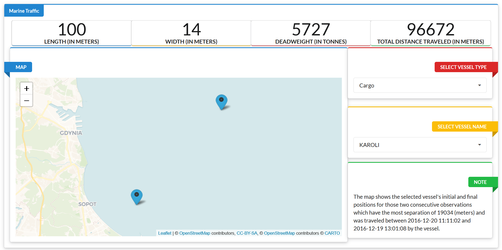

# [Marine Traffic](https://github.com/chrl3hr5/Marine-Traffic)

A shiny web application for analyzing marine data involving the travel
history of various vessels (ships) and other relevant information.

<i> The app includes the following sections - </i>

<b> Value Boxes </b> - The app contains four value boxes on the top for
displaying the values associated with vessel’s length (in meters), width
(in meters), deadweight (in tonnes) and total distance traveled (in
meters).

<b> Map </b> - Below the values boxes on the left-hand side is a map
which displays the selected vessel’s initial and final positions for
those two consecutive observations which have the most separation
between them in terms of GPS coordinate location.

<b> Dropdown Menus and Note Box </b> - There are two dropdown menus on
the right-hand side of the map for selecting the vessel’s type and name,
followed by a note box containing information regarding the locations
marked on the map.
